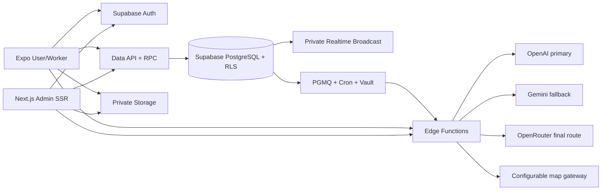

# System Architecture

## Overview

A-YOS uses Supabase as the application platform. Expo and Next.js clients authenticate through Supabase Auth, read authorized data through generated Data APIs, invoke transactional PostgreSQL RPC functions for protected workflows, upload to private Storage, and subscribe to private Realtime channels. Edge Functions contain secret-bearing integrations only.

## Data and command boundaries

- PostgreSQL is authoritative. Foreign keys, checks, partial unique indexes, numeric money fields, and optimistic booking versions preserve integrity.
- RLS is enabled on every public application table. Reads enforce role, owner, booking party, conversation membership, moderation state, and administrator assurance.
- Low-risk profile, availability, address, favorite, message, and ticket operations use restricted column grants plus RLS.
- Matching, selection, booking transitions, location recording, payment confirmation, reviews, verification, refunds, content, settings, suspension, Trash, and Restore use security-definer RPCs.
- Permanent deletion always raises `PERMANENT_DELETION_BLOCKED` and creates an audit event for authorized attempts.

## Geospatial architecture

- PostGIS `geography(Point,4326)` is authoritative for worker service origins, saved-address coordinates, service-request location snapshots, and booking location updates. Numeric latitude/longitude values are generated projections for typed clients and Realtime payloads.
- GiST indexes support radius eligibility through `ST_DWithin`; `ST_Distance` supplies deterministic distance ordering after skills, approval, availability, and schedule eligibility. Recommendation priority is only a final tie-breaker.
- Expo uses one typed map contract with `maplibre-gl` on web and `@maplibre/maplibre-react-native` on Android/iOS. Maps consume GeoJSON rather than database-specific geometry values.
- Tracking reads use a security-definer booking-party RPC. Location writes are accepted only from the assigned Worker during the active travel/service states.

## Authentication and authorization

- Supabase owns passwords, email OTP verification/recovery, access tokens, refresh rotation, and session revocation.
- An `auth.users` trigger creates exactly one immutable application role. User metadata can create only User or Worker accounts; Administrator requires service-controlled app metadata.
- Protected administrators are bootstrapped with the secret key and a hashed, ten-minute, single-use ticket consumed by the Auth provisioning transaction. The temporary raw ticket is cleared from Auth metadata after provisioning. Administrator self-registration and soft deletion are prohibited.
- Optional administrator authenticator-app TOTP replaces email 2FA. Sensitive administrator RPCs require AAL2 when MFA is enabled.
- Mobile persists sessions through an Expo SecureStore adapter. Admin uses secure SSR cookies. Secret/service-role keys never enter clients.

## Storage, realtime, and jobs

- Six private buckets enforce owner-prefixed paths, MIME/size limits, membership, and administrator review.
- Realtime public access is disabled operationally; RLS protects status, location, conversation, and notification topics.
- Database triggers broadcast only committed changes.
- PGMQ queues booking timeouts, no-match notices, scheduled notifications, and provider work. Cron invokes a secret-authenticated consumer using Vault values. Consumers are idempotent, retry five times, archive completed work, and record terminal failures.

## Integrations and deployment

- AI analysis is an authenticated Edge Function with private-media ownership, MIME/size, idempotency, shared output validation, and attempt auditing. OpenAI Responses (`gpt-5.6-sol`) is primary, Gemini (`gemini-3.5-flash`) is secondary, and OpenRouter is final; fallback occurs only for retryable transport, timeout, throttling, and 5xx failures. Voice uses `gpt-4o-transcribe` before analysis.
- Geocoding, reverse geocoding, route geometry, and ETA use an authenticated map-gateway Edge Function. Booking routes require participant visibility and fail closed without gateway bindings.
- Translation and push remain fail-closed provider boundaries until configured.
- Local development uses Supabase CLI. Staging and production use separate hosted Supabase projects with migration-first deployment and generated types.
- Formal capacity, retention, backup, RPO, and RTO targets remain blocked by missing requirements. Supabase project backup/PITR settings must be selected before production acceptance.

## Testing architecture

- pgTAP validates schema, RLS, Storage, RPCs, role scenarios, and domain invariants on the local Supabase stack.
- Vitest validates shared contracts, static security controls, calculations, ranking, state transitions, redaction, and traceability.
- Mobile/admin E2E suites cover Auth, TOTP, worker approval, matching, booking, cash closure, reviews, support, and administration when a test Supabase stack is available.
