# A-yos — User Flow

This file contains a high-level user-flow diagram for the A-yos provider marketplace app. Shapes indicate screen types and decisions.

Design target: iPhone 15 / 393×852 dp. Colors and tokens are defined in `constants/theme.ts`.

Palette (key tokens):

- Primary / CTA: `#0B63D6`
- Primary Light: `#4DA5FF`
- Success: `#117A5C`
- Warning: `#F59E0B`
- Error: `#C53030`
- Background: `#F7F9FC`

Use this Mermaid diagram as a reference; update nodes if you add new screens.

```mermaid
flowchart LR
  %% Nodes
  Start((Start))
  Onboarding[Onboarding Screen]
  Home[Home / Dashboard]
  Tabs[[Tabs: Home, Browse, Bookings, Reviews, Profile]]
  Search[Browse / Search]
  Provider[Provider Profile]
  Booking[Booking Flow]
  Payment[Payment Modal]
  Confirm(Confirmation)
  Tracking[Live Tracking]
  ReviewModal[Review Modal]
  BookingsList[My Bookings]
  BookingDetails[Booking Details]
  ProfileScreen[Profile]
  EditProfile[Edit Profile]
  NotFound[404 / Not Found]

  Start --> Onboarding
  Onboarding --> Home
  Home --> Tabs
  Tabs --> Search
  Tabs --> BookingsList
  Tabs --> ReviewModal
  Tabs --> ProfileScreen
  Search --> Provider
  Provider --> Booking
  Booking --> Payment
  Payment --> Confirm
  Confirm --> Tracking
  Tracking --> BookingDetails
  Confirm --> BookingDetails
  BookingDetails --> ReviewModal
  ProfileScreen --> EditProfile
  Provider -->|View Reviews| ReviewModal
  Provider -->|Contact / Call| ProfileScreen
  NotFound -.-> Home

  %% Decisions
  hasAuth{Authenticated?}
  Home --> hasAuth
  hasAuth -->|No| Onboarding
  hasAuth -->|Yes| Tabs

  classDef screen fill:#f8f9fa,stroke:#333,stroke-width:1px;
  classDef modal fill:#fff8c4,stroke:#b58900;
  classDef decision fill:#e0f7fa,stroke:#00796b,stroke-width:1px;
  class Start,Onboarding,Home,Tabs,Search,Provider,Booking,Confirm,Tracking,BookingsList,BookingDetails,ProfileScreen,EditProfile,NotFound screen;
  class Payment,ReviewModal modal;
  class hasAuth decision;
```

