# A-yos — User Flow

This file contains a high-level user-flow diagram for the A-yos **customer-facing** app. For the worker flow, see [worker-flow.md](./worker-flow.md).

Design target: iPhone 15 / 393×852 dp. Colors and tokens are defined in `constants/theme.ts`.

Palette (key tokens):

- Primary / CTA: `#0B63D6`
- Primary Light: `#4DA5FF`
- Success: `#117A5C`
- Warning: `#F59E0B`
- Error: `#C53030`
- Background: `#F7F9FC`

## Architecture

The app has two modes — **User** and **Worker** — switchable via the "Switch Account" button on each Profile screen. Each mode has its own bottom tab navigator.

| Mode | Tab Navigator | Tabs |
|------|---------------|------|
| User | `(tabs)` | Home, Browse, Bookings, Profile |
| Worker | `(worker)` | Dashboard, Browse, Bookings, Reviews, Profile |

Shared screens (accessible from both modes): Provider Detail, Booking, Payment, Tracking, Review Modal.

## Screen Inventory

| # | Screen | Route | Parent | Presentation |
|---|--------|-------|--------|--------------|
| 1 | Home | `/(tabs)/` | Tab | tab |
| 2 | Browse | `/(tabs)/search` | Tab | tab |
| 3 | Bookings | `/(tabs)/bookings` | Tab | tab |
| 4 | Reviews | `/(tabs)/reviews` | Tab | hidden (href: null) |
| 5 | Profile | `/(tabs)/profile` | Tab | tab |
| 6 | Provider Detail | `/provider/:id` | Stack | slide_from_right |
| 7 | Schedule Booking | `/booking/:id` | Stack | slide_from_right |
| 8 | Payment | `/payment` | Stack | modal |
| 9 | Live Tracking | `/tracking/:id` | Stack | slide_from_right |
| 10 | Rate & Review | `/review/:id` | Stack | modal |
| 11 | 404 | `+not-found` | Stack | default |

## Mermaid Diagram

```mermaid
flowchart LR
  %% Nodes
  Start((Start))
  Onboarding[Onboarding Screen]
  Home[Home / Dashboard]
  Tabs[[Tabs: Home, Browse, Bookings, Profile]]
  Search[Browse / Search]
  Provider[Provider Profile]
  Booking[Schedule Booking]
  Payment[Payment Modal]
  Tracking[Live Tracking]
  ReviewModal[Rate & Review Modal]
  BookingsList[My Bookings]
  ProfileScreen[Profile]
  SwitchAccount{{Switch to Worker?}}
  WorkerTabs[[Worker Tabs: Dashboard, Browse, Bookings, Reviews, Profile]]
  NotFound[404 / Not Found]

  %% Flow
  Start --> Onboarding
  Onboarding --> Home
  Home --> Tabs
  Tabs --> Search
  Tabs --> BookingsList
  Tabs --> ProfileScreen
  Tabs --> ReviewModal

  Search --> Provider
  Provider --> Booking
  Booking --> Payment
  Payment --> Tracking
  Tracking --> ReviewModal
  BookingsList -->|Track| Tracking
  BookingsList -->|View| Provider
  BookingsList -->|Leave Review| ReviewModal
  BookingsList -->|Book Again| Provider
  Provider -->|See all reviews| ReviewModal
  Provider -->|Write a Review| ReviewModal
  ProfileScreen --> SwitchAccount
  SwitchAccount -->|Yes| WorkerTabs

  NotFound -.-> Home

  %% Decisions
  hasAuth{Authenticated?}
  Home --> hasAuth
  hasAuth -->|No| Onboarding
  hasAuth -->|Yes| Tabs

  classDef screen fill:#f8f9fa,stroke:#333,stroke-width:1px;
  classDef modal fill:#fff8c4,stroke:#b58900;
  classDef decision fill:#e0f7fa,stroke:#00796b,stroke-width:1px;
  classDef tabgroup fill:#e8f5e9,stroke:#2e7d32,stroke-width:2px;
  class Start,Onboarding,Home,Search,Provider,Booking,Tracking,BookingsList,ProfileScreen,NotFound screen;
  class Payment,ReviewModal modal;
  class hasAuth,SwitchAccount decision;
  class Tabs,WorkerTabs tabgroup;
```

## User Journey

1. **Launch** → Onboarding (not yet implemented) → Home tab
2. **Browse providers** → Tap provider card → Provider Detail → Book Now → Schedule Booking → Payment → Tracking → Review
3. **Manage bookings** → Bookings tab → Track / View / Leave Review / Book Again
4. **View provider reviews** → Provider Detail → "See all" → Reviews list (filtered by provider)
5. **Write a review** → Provider Detail → "Write a Review" → Rate & Review modal
6. **Switch to worker** → Profile tab → "Switch Account" → Worker app
