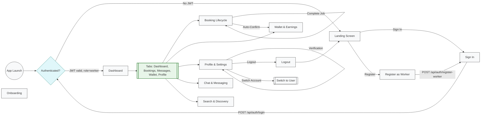

# A-yos — Worker Flow

This file documents the complete **service-provider (worker)** flow for the A-yos app. It assumes a connected backend with a database, JWT-based authentication, and integration with the registration/sign-in flows described in [auth-flow.md](./auth-flow.md). For the customer flow, see [user-flow.md](./user-flow.md).

Design target: iPhone 15 / 393×852 dp. Colors and tokens are defined in `constants/theme.ts`.

Palette (key tokens):

- Primary / CTA: `#071022`
- Primary Light: `#1A2B4C`
- Success: `#117A5C`
- Warning: `#F59E0B`
- Error: `#C53030`
- Info: `#0B63D6`
- Background: `#F8F9FB`

## Architecture

The app has two modes — **User** and **Worker** — switchable via the "Switch Account" button on each Profile screen. Each mode has its own bottom tab navigator.

| Mode | Tab Navigator | Tabs |
|------|---------------|------|
| User | `(tabs)` | Home, Browse, Bookings, Profile |
| Worker | `(worker)` | Dashboard, Bookings, Messages, Wallet, Profile |

Shared screens (accessible from both modes): Chat, Notifications, Provider Detail, Booking, Payment, Tracking, Review Modal.

### Auth Integration

Workers register via the 4-step worker registration flow (`POST /api/auth/register-worker`) and sign in via the shared sign-in screen (`POST /api/auth/login`). On successful login, a JWT is stored containing `role: 'worker'`. The app checks the role and redirects to `/(worker)`.

**Logout** clears the stored JWT and refresh token, resets app state, and redirects to the landing screen (`router.replace('/')`).

For full auth details, see [auth-flow.md](./auth-flow.md).

## Screen Inventory

| # | Screen | Route | Parent | Presentation | API Endpoint |
|---|--------|-------|--------|--------------|--------------|
| 1 | Dashboard | `/(worker)/` | Tab | tab | `GET /api/worker/dashboard` |
| 2 | Bookings | `/(worker)/bookings` | Tab | tab | `GET /api/worker/bookings` |
| 3 | Messages | `/(worker)/messages` | Tab | tab | `GET /api/worker/chats` |
| 4 | Wallet | `/(worker)/wallet` | Tab | tab | `GET /api/worker/wallet` |
| 5 | Profile | `/(worker)/profile` | Tab | tab | `GET /api/worker/profile` |
| 6 | Booking Request | `/(worker)/booking-request/[id]` | Stack | slide_from_right | `GET /api/worker/bookings/:id` |
| 7 | Universal Search | `/(worker)/universal-search` | Stack | slide_from_right | `GET /api/worker/search` |
| 8 | Job Posts (Browse) | `/(worker)/search` | Stack | slide_from_right | `GET /api/worker/job-posts` |
| 9 | Reviews | `/(worker)/reviews` | Stack | slide_from_right | `GET /api/worker/reviews` |
| 10 | Verification | `/(worker)/verification` | Stack | slide_from_right | `GET /api/worker/verification` |
| 11 | Availability | `/(worker)/availability` | Stack | slide_from_right | `GET/PUT /api/worker/availability` |
| 12 | Transactions History | `/(worker)/transactions-history` | Stack | slide_from_right | `GET /api/worker/transactions` |
| 13 | Personal Info | `/(worker)/personal-info` | Stack | slide_from_right | `GET/PUT /api/worker/profile` |
| 14 | Industry & Skills | `/(worker)/industry-skills` | Stack | slide_from_right | `GET/PUT /api/worker/industry-skills` |
| 15 | Work Experience | `/(worker)/work-experience` | Stack | slide_from_right | `GET/POST/DELETE /api/worker/experience` |
| 16 | Service Areas | `/(worker)/service-areas` | Stack | slide_from_right | `GET/PUT /api/worker/service-areas` |
| 17 | Portfolio | `/(worker)/portfolio` | Stack | slide_from_right | `GET/POST/DELETE /api/worker/portfolio` |
| 18 | Payout Methods | `/(worker)/payout-methods` | Stack | slide_from_right | `GET/POST/DELETE /api/worker/payout-methods` |
| 19 | Payout History | `/(worker)/payout-history` | Stack | slide_from_right | `GET /api/worker/payouts` |
| 20 | Settings | `/(worker)/settings` | Stack | modal | — |
| 21 | Help Center | `/(worker)/help` | Stack | slide_from_right | `GET /api/worker/faq` |
| 22 | Privacy Policy | `/(worker)/privacy` | Stack | slide_from_right | Static content |
| 23 | Earnings Receipt | `/(worker)/earnings-receipt` | Stack | slide_from_right | `GET /api/worker/transactions/:id` |
| 24 | Cancel Service | `/(worker)/cancel-service/[id]` | Stack | slide_from_right | `POST /api/worker/bookings/:id/cancel` |
| 25 | Chat | `/messages/chat` | Stack | slide_from_right | `GET/POST /api/worker/chats/:id/messages` |
| 26 | Notifications | `/notifications` | Stack | slide_from_right | `GET /api/worker/notifications` |

## Mermaid Diagram — High-Level Flow



## Mermaid Diagram — Booking Lifecycle

```mermaid
flowchart TD
  %% States
  Hired[hired — Customer Selected Worker]
  Accepted[accepted — Worker Accepted]
  EnRoute[en_route — Worker Traveling]
  InProgress[in_progress — Job in Progress]
  PendingReview[pending_review — Awaiting Auto-Confirm]
  Completed[completed — Job Complete]
  Cancelled[cancelled — Service Cancelled]

  %% Transitions
  Hired -->|Accept Booking| Accepted
  Hired -->|Reschedule| RescheduleDialog[Reschedule Dialog]
  RescheduleDialog -->|Propose new date/time| Hired
  Hired -->|Cancel Service| CancelFlow[Cancel Service Flow]
  CancelFlow --> Cancelled

  Accepted -->|Start Traveling| EnRoute
  Accepted -->|Cancel Service| CancelFlow

  EnRoute -->|I've Arrived| InProgress
  EnRoute -->|Cancel Service| CancelFlow

  InProgress -->|Complete Job| PendingReview
  InProgress -->|Cancel Service| CancelFlow

  PendingReview -->|Auto-Confirm (timer)| Completed
  PendingReview -->|Customer Confirms| Completed

  Completed -->|View Receipt| Receipt[Earnings Receipt]
  Completed -->|Leave Feedback| Reviews[Reviews]

  %% Shared Components
  Chat[Chat with Customer] -.->|Available at all active states| Hired
  CallMessage[Call / Message] -.->|Available at en_route, in_progress, pending_review| EnRoute

  classDef state fill:#e8f5e9,stroke:#2e7d32,stroke-width:2px;
  classDef terminal fill:#ffebee,stroke:#c62828,stroke-width:2px;
  classDef action fill:#e3f2fd,stroke:#1565c0,stroke-width:1px;
  classDef component fill:#f3e5f5,stroke:#7b1fa2,stroke-width:1px,stroke-dasharray: 5 5;
  class Hired,Accepted,EnRoute,InProgress,PendingReview state;
  class Completed terminal;
  class Cancelled terminal;
  class RescheduleDialog,CancelFlow,Receipt,Reviews action;
  class Chat,CallMessage component;
```

## Tab Details

### Dashboard (`/(worker)/index.tsx`)

**Backend:** `GET /api/worker/dashboard` — returns today's stats, active bookings, incoming job alerts, worker performance.

| Section | Content | Details |
|---------|---------|---------|
| Currently Working Banner | Conditional orange banner | Shown when `isCurrentlyWorking` is true. Taps → booking request detail. |
| Top Navigation Bar | Avatar, search bar, notification bell | Avatar → profile. Search → universal search. Bell → notifications (with unread badge). |
| Today Stats Card | 2×2 stat grid | Active (in_progress/en_route count), Pending (hired/accepted count), Completed (completed count), Earnings (sum of completed today). |
| Incoming Job Alert | Job card from `workerJobs` | Shows customer, service, urgency badge. "More Details" → booking request. |
| Quick Actions Grid | 4 icon tiles | Schedule → availability, Earnings → wallet, Premium → settings, Verification → verification. |
| Active Bookings | Booking card list | Excludes completed/cancelled/pending_review. Each card shows avatar, name, service, status, time, address. Taps → booking request. "See All Bookings" → bookings tab. |
| Worker Performance Card | Name, badge, 3 progress bars | Completion Rate, On-Time Arrival, Repeat Clients. Data from `walletPerformance`. |

### Bookings (`/(worker)/bookings.tsx`)

**Backend:** `GET /api/worker/bookings?status={filter}` — returns bookings filtered by status.

| Section | Content | Details |
|---------|---------|---------|
| Working Banner | Conditional orange banner | Shown when `isCurrently_working`. |
| Filter Tabs | 4 horizontal tabs | Upcoming (`hired`, `accepted`), In Progress (`en_route`, `in_progress`), Completed (`pending_review`, `completed`), Cancelled (`cancelled`). Accepts `?filter=Cancelled` query param. |
| Booking Cards | FlatList of bookings | Avatar, name, service, status badge, date, time, address, price, parts indicator. Status-specific footer: "View" button, "Working..." button, "Paid" text, or "Awaiting confirmation" text. |
| Empty State | "No Bookings" message | Shown when no bookings match the selected filter. |

**Actions by status:**

| Status | Buttons |
|--------|---------|
| Upcoming (hired/accepted) | "View" → booking request |
| In Progress (in_progress) | "Working..." → booking request |
| In Progress (en_route) | "View" → booking request |
| Completed | "Paid · {price}" (no button) |
| Cancelled | Status badge only |

### Messages (`/(worker)/messages.tsx`)

**Backend:** `GET /api/worker/chats` — returns list of conversations with last message, unread count.

| Section | Content | Details |
|---------|---------|---------|
| Header | "Messages" title | — |
| Chat List | FlatList of conversations | Avatar, name, last message preview, timestamp, unread count badge. Taps → chat screen. |
| Empty State | "No Messages Yet" | Shown when list is empty. |

Each chat row navigates to `/messages/chat?id={chatId}` (shared chat screen, see below).

### Wallet (`/(worker)/wallet.tsx`)

**Backend:** `GET /api/worker/wallet` — returns balance, pending clearance, transactions, chart data, payout methods.

| Section | Content | Details |
|---------|---------|---------|
| Balance Card | Available balance + pending clearance | Shows "Available Balance" (e.g., P18,450.00) and "Pending Clearance" (e.g., P600.00). Two buttons: "Top-Up" and "Payout" (each opens a modal). |
| Bar Chart | Daily earnings this week | 7-day bar chart from `walletBarData`. Peak day indicator. |
| Period Toggle | This Week / This Month / All Time | Chip filters that update stats grid. |
| Stats Grid | 2×2 card | Gross Earnings, Net Earnings, Jobs Completed, Commission Paid. Values change per period. |
| Transactions | Filter chips + top 3 rows | All / Income / Deductions filter. Each row: icon, label, amount, sub, date, status. Taps → earnings receipt. "See All Transactions" → transactions history. |

**Modals:**

| Modal | Trigger | Contents |
|-------|---------|----------|
| Payout Sheet | "Payout" button | Amount input, quick amounts, payout method selection, processing note, confirm/cancel. |
| Top-Up Sheet | "Top-Up" button | Amount input, quick amounts, pay-with method, confirm/cancel. |
| Payout Success | Confirm payout | Green checkmark, amount + method, "Done" button. |
| Top-Up Success | Confirm top-up | Green checkmark, amount + method, "Done" button. |

### Profile (`/(worker)/profile.tsx`)

**Backend:** `GET /api/worker/profile` — returns worker profile, stats, skills, availability, service areas.

| Section | Content | Details |
|---------|---------|---------|
| Profile Header | Avatar, name, email, verified badge | Avatar is tappable for image picker. |
| Stats Row | 3-column card | Jobs Done, Rating (star), Earnings. |
| Skills Chips | First 4 skills + overflow | From `workerProfile.skills`. "+N" chip for overflow. |
| Pricing & Service Card | Rate, category, service areas | Rate per hour, industry category, first 2 service areas + overflow count. |
| Availability Summary | Day dots (Mon–Sun) | Shows which days are available, count of available days. |
| Experience Summary | Years of experience, review count | — |
| Menu Sections | 4 sections, 15 items | See table below. |
| Log Out | Red outlined button | Clears JWT, redirects to landing. |

**Menu Items:**

| Section | Item | Navigation Target |
|---------|------|-------------------|
| Account | Personal Information | `personal-info?from=profile` |
| Account | Industry & Skills | `industry-skills?from=profile` |
| Account | Work Experience | `work-experience?from=profile` |
| Account | Availability | `availability?from=profile` |
| Account | Service Areas | `service-areas?from=profile` |
| Account | Portfolio | `portfolio?from=profile` |
| Account | My Reviews | `reviews?from=profile` |
| Payments | Payout Methods | `payout-methods?from=profile` |
| Payments | Payout History | `payout-history?from=profile` |
| Payments | Top-Up Methods | `payout-methods?from=profile` |
| Payments | Top-Up History | `payout-history?from=profile` |
| Preferences | Notifications | Alert: "Coming Soon" |
| Preferences | App Appearance | Alert: "Coming Soon" |
| Support & Legal | Verification | `verification?from=profile` |
| Support & Legal | Help Center | `help?from=profile` |
| Support & Legal | Privacy Policy | `privacy?from=profile` |

---

## Hidden Screen Details

### Booking Request (`/(worker)/booking-request/[id].tsx`)

**Backend:** `GET /api/worker/bookings/:id`, `PUT /api/worker/bookings/:id/accept`, `PUT /api/worker/bookings/:id/status`, `POST /api/worker/bookings/:id/reschedule`, `POST /api/worker/bookings/:id/cancel`.

This is the most complex screen. It renders state-specific content based on `booking.status`.

**Shared Sections (always rendered):**

| Section | Content |
|---------|---------|
| Job Card | Step indicator, status badge, service name, booking ID, urgency badge, optional image, description, client name, location, schedule, estimated earnings, 3-dot menu |
| Client Card | Avatar, name, "N bookings - No cancellations", "Good client" badge |
| ThreeDotMenu | "Report User" (alert), "Cancel Service" → `cancel-service/${id}` |

**Status-Specific Content:**

| Status | Section | Actions |
|--------|---------|---------|
| `hired` | "You've Been Selected!" banner, step indicator, status badge | "Accept Booking" → `accepted`. "Reschedule" → opens `<RescheduleDialog>`. |
| `accepted` | Chat section with `<BookingChat>`, customer name/avatar | "Confirm Details" button. "Open Full Chat" → `/messages/chat?id=${id}`. |
| `en_route` | `<BookingMap>` with lat/lng, call/message buttons | "I've Arrived" → `in_progress`. |
| `in_progress` | `<JobTimer>` with hourly rate, call/message buttons | "Complete Job" → `pending_review`. |
| `pending_review` | Waiting card with spinner, auto-confirm countdown timer, call/message buttons | Auto-transitions to `completed` after timeout. |
| `completed` | `<CompletedSummary>` with duration, earnings | "Leave Feedback" (alert). "View Receipt" → `earnings-receipt?bookingId=...&duration=...&earnings=...&from=booking`. |
| `cancelled` | Cancelled banner with XCircle icon | None. |

**RescheduleDialog:**

Modal dialog for proposing a new date/time to the customer. Contains:
- Date text input
- Quick-time chips (Morning 8AM, Midday 12PM, Afternoon 2PM, Evening 5PM)
- Custom time input
- Optional message to customer
- `onConfirm(date, time, message)` → shows Alert with proposed reschedule → navigates back

**Auto-Transition:** When status is `pending_review`, a countdown timer starts. When the timer expires, status auto-changes to `completed`.

**Cancel Service Flow:** ThreeDotMenu → "Cancel Service" → `cancel-service/${id}`.

---

### Universal Search (`/(worker)/universal-search.tsx`)

**Backend:** `GET /api/worker/search?q={query}` — returns categorized search results.

| Section | Content | Details |
|---------|---------|---------|
| Search Header | PageHeader + auto-focusing SearchBar | Header renders outside ScrollView (fixed position). |
| Quick Links Grid | 8 icon tiles | Profile, Wallet, Bookings, Messages, Help Center, Settings, My Reviews, Industry & Skills. |
| Recent Bookings | First 3 bookings | Shown when no query entered. |
| Search Results | Categorized results | Grouped by: Bookings, Job Opportunities, Reviews, Transactions, Skills, Profile, Service Areas, Screens (15 searchable screen links). |
| Empty State | "No results found" | SearchX icon. |

---

### Job Posts / Browse (`/(worker)/search.tsx`)

**Backend:** `GET /api/worker/job-posts?filter={filter}&sort={sort}&q={query}` — returns job post listings.

| Section | Content | Details |
|---------|---------|---------|
| Search Bar | Text input | Filters by customer name, service, description. |
| Filter Chips | All / Urgent / Nearby / High Pay | Urgent: `urgency === 'urgent'`. Nearby: `distance <= 1.5 mi`. High Pay: `price >= $100`. |
| Sort Chips | Nearest / Highest Pay / Most Recent | Default: Nearest. |
| Post Count | "{N} posts available" | — |
| Job Post Cards | FlatList of posts | LinkedIn-style cards with image preview, comments, share. |

**Job Post Card Features:**

| Feature | Details |
|---------|---------|
| Author header | Avatar, customer name, posted time, urgency badge |
| Content | Service title, description, image preview (16:9) |
| Meta row | Location (left), price (right) |
| Action bar | Comment button with count (left), Share button (right) |
| Comment section | Newest/Oldest sort toggle, comment input with description + min/max price range |
| Offer badge | Green pill showing `$min - $max` offer range |

Workers can comment on posts with an offer (description + price range). New comments appear at top immediately.

---

### Reviews (`/(worker)/reviews.tsx`)

**Backend:** `GET /api/worker/reviews?rating={n}&sort={sort}&q={query}` — returns reviews with rating summary.

| Section | Content | Details |
|---------|---------|---------|
| PageHeader | "My Reviews" | Back navigation via `?from` param. |
| SearchBar | Filters by author, comment, service type | — |
| ReviewsTab | Rating summary + filtered reviews | Large average rating, star distribution bar chart, filter chips (All, 5 Stars, 4 Stars, 3 Stars, Recent), review cards with avatar, name, stars, date, service tag, comment, "Helpful" thumb toggle. |

---

### Verification (`/(worker)/verification.tsx`)

**Backend:** `GET /api/worker/verification` — returns verification status, documents, steps.

| Section | Content | Details |
|---------|---------|---------|
| Status Banner | "Under Review" with clock icon | "Submitted Jul 8 · Est. 1-2 business days", "STEP 3 / 5" pill. |
| Tab Switcher | 3 tabs | Status, Documents, FAQ. |

**Status Tab:**

| Step | Status | Details |
|------|--------|---------|
| 1. Registration | Done | Jul 5 |
| 2. Document Upload | Done | Jul 8 |
| 3. Admin Review | Active (pulse animation) | Est. 1-2 business days remaining |
| 4. Verification Fee | Pending | P299 |
| 5. Profile Activated | Pending | — |

Also shows: AlertCard (action required: photo rejected), TipsCard (while you wait), NextStepsCard (after approval).

**Documents Tab:**

| Stat | Count |
|------|-------|
| Verified | 2 |
| In Review | 1 |
| Issues | 2 |

Document list (5 items): Government ID (verified), NBI Clearance (verified), Skill Certificate (in review), Professional Photo (rejected), Barangay Clearance (missing). Upload area for additional docs.

**FAQ Tab:** 6 accordion items covering verification time, rejection reasons, fee purpose, working while pending, rejection process, verified badge. Support card with contact info.

---

### Availability (`/(worker)/availability.tsx`)

**Backend:** `GET/PUT /api/worker/availability` — returns/updates weekly schedule.

| Section | Content | Details |
|---------|---------|---------|
| PageHeader | "My Availability" | — |
| Subtitle | Clock icon + "Set your weekly working hours" | — |
| Day Count | "{N} day(s) available" | — |
| Day Rows (Mon–Sun) | Switch toggle + time inputs | When available: start time → end time inputs. When unavailable: "Unavailable" text. |
| Save Button | Validates all available days have times | Shows "Saved" alert. Navigates back via `?from`. |

---

### Transactions History (`/(worker)/transactions-history.tsx`)

**Backend:** `GET /api/worker/transactions?type={type}&from={date}&to={date}&q={query}` — returns filtered transactions.

| Section | Content | Details |
|---------|---------|---------|
| PageHeader | "Transaction History" | — |
| SearchBar | Searches by label, sub, amount | — |
| Type Filter Chips | All / Income / Deductions | — |
| Date Range Inputs | From / To date text inputs | — |
| Transaction Groups | Grouped by date, sorted newest first | Each row: colored icon (green=credit, red=commission, blue=payout), label, amount, sub, status icon + label. Taps → earnings receipt. |
| Empty State | "No transactions found" | — |

---

### Personal Info (`/(worker)/personal-info.tsx`)

**Backend:** `GET/PUT /api/worker/profile` — returns/updates personal information.

| Section | Content | Details |
|---------|---------|---------|
| PageHeader | "Personal Information" | — |
| Form Fields | 5 fields | Full Name (required), Email (required), Phone (required), Address, Bio (multiline, 200 char counter). |
| Save Button | Validates required fields | Shows "Saved" alert. |

---

### Industry & Skills (`/(worker)/industry-skills.tsx`)

**Backend:** `GET/PUT /api/worker/industry-skills` — returns/updates industry and skills. `GET /api/skills?industry={id}` for skill options.

| Section | Content | Details |
|---------|---------|---------|
| PageHeader | "Industry & Skills" | — |
| Primary Industry | Tappable card → autocomplete | Selecting new industry clears current skills. |
| Skills Section | Selected skills (removable chips) + autocomplete | Multi-select mode, filtered by current industry. Supports custom skill addition. |
| Save Button | Disabled when no changes | Shows "Saved" alert. |

---

### Work Experience (`/(worker)/work-experience.tsx`)

**Backend:** `GET/POST/PUT/DELETE /api/worker/experience` — CRUD for work history.

| Section | Content | Details |
|---------|---------|---------|
| PageHeader | "Work Experience" | — |
| Add Button | "Add Experience" outline button | — |
| Inline Form | Company, role, start/end dates, "Currently working" switch, description | Cancel / Save buttons. |
| Experience Cards | List of past experiences | Building icon + role + company, date badge, "Current" badge, description, edit/delete buttons. |

---

### Service Areas (`/(worker)/service-areas.tsx`)

**Backend:** `GET/PUT /api/worker/service-areas` — returns/updates service coverage areas.

| Section | Content | Details |
|---------|---------|---------|
| PageHeader | "Service Areas" | — |
| Current Areas | Chip list with remove buttons | Shows count. |
| Search/Add | SearchBar + "+" button | Autocomplete from `SUGGESTED_AREAS` (15 Metro Manila cities). |
| Popular Areas Grid | Quick-add chips | Remaining suggested areas. |
| Save Button | "Save {N} Area(s)" | — |

---

### Portfolio (`/(worker)/portfolio.tsx`)

**Backend:** `GET/POST/DELETE /api/worker/portfolio` — CRUD for portfolio images.

| Section | Content | Details |
|---------|---------|---------|
| PageHeader | "Portfolio" | — |
| Empty State | "No Portfolio Items" | Prompt to add photos. |
| Image Grid | 2-column grid | From `workerProfile.portfolioImages`. |
| Image Counter | "{N} photo(s)" | — |
| Full-Screen Modal | Lightbox viewer | Close button, left/right navigation, image counter "N / M". |

---

### Payout Methods (`/(worker)/payout-methods.tsx`)

**Backend:** `GET/POST/DELETE /api/worker/payout-methods` — manage payout accounts.

| Section | Content | Details |
|---------|---------|---------|
| PageHeader | "Payout Methods" | — |
| Methods List | Cards with color dot, name, account number | "Default" badge for primary. "Set as Default" link. Remove button with confirmation. |
| Add Button | "Add New Method" dashed border | Opens add method flow (alert placeholder). |

---

### Payout History (`/(worker)/payout-history.tsx`)

**Backend:** `GET /api/worker/payouts?status={status}&q={query}` — returns payout records.

| Section | Content | Details |
|---------|---------|---------|
| PageHeader | "Payout History" | — |
| SearchBar | Searches by method, amount, reference | — |
| Status Filter Chips | All / Completed / Pending / Failed | — |
| Payout List | Cards with ArrowDownToLine icon | Method name, date, amount, reference ID, status icon + label. |
| Empty State | "No payouts found" / "No {status} payouts" | — |

---

### Settings (`/(worker)/settings.tsx`)

| Section | Content | Details |
|---------|---------|---------|
| Info Card | "Settings and preferences can be managed from your Profile." | — |
| SearchBar | Search settings (placeholder) | — |
| Menu Item | "Industry & Skills" | → `industry-skills?from=settings` |

---

### Help Center (`/(worker)/help.tsx`)

**Backend:** `GET /api/worker/faq` — returns FAQ items.

| Section | Content | Details |
|---------|---------|---------|
| PageHeader | "Help Center" | — |
| Quick Contact Row | 3 cards | Call Us (+63 917 123 4567), Email Us (support@ayos.com), Live Chat (Chat Now). |
| FAQ Section | 8 expandable accordion items | Accepting/declining bookings, updating availability, adding skills, requesting payouts, customer cancellations, account verification, rating calculation. |
| Report Issue Form | Subject + Message + "Submit Issue" | Validates fields, shows confirmation alert. |

---

### Privacy Policy (`/(worker)/privacy.tsx`)

| Section | Content | Details |
|---------|---------|---------|
| PageHeader | "Privacy Policy" | — |
| Header | Title + "Last updated: July 20, 2026" | — |
| 6 Sections | Static text | Information We Collect, How We Use Your Information, Information Sharing, Data Security, Your Rights, Contact Us. |

---

### Earnings Receipt (`/(worker)/earnings-receipt.tsx`)

**Backend:** `GET /api/worker/transactions/:id` — returns transaction details for receipt.

| Section | Content | Details |
|---------|---------|---------|
| PageHeader | "Earnings Receipt" | — |
| Success Header | Green checkmark, "Payment Received", earnings amount | — |
| Receipt Card | Detailed breakdown | Transaction ID, date, time, service, customer, location, duration. Earnings breakdown: Base Amount, Platform Fee (10%), Net Earnings. Payment method (e.g., "GCash (Escrow)"). |
| Action Buttons | "Download Receipt", "Share Receipt" | Alerts: saved to downloads / ready to share. |

Query params: `bookingId`, `duration`, `earnings`, `from`.

---

### Cancel Service (`/(worker)/cancel-service/[id].tsx`)

**Backend:** `POST /api/worker/bookings/:id/cancel` — submits cancellation with reason.

| Section | Content | Details |
|---------|---------|---------|
| Header | "Cancel Service" | — |
| Title | "Why are you canceling this booking?" | — |
| Job Stage Dropdown | Select stage | Before Traveling, After Arriving, After Inspecting. |
| Accordion Reason Sections | Reasons grouped by category | Filtered by selected job stage. Categories: Customer-related, Worker-related, Job-related, Policy & Safety, Other. |
| Custom Reason Input | Free text with auto-complete | Matches first 5 reasons when 2+ chars typed. |
| Confirm Button | "Confirm Cancellation" (danger) | Disabled until reason selected or custom text entered. |
| Confirmation Modal | `<CancellationConfirmation>` | Customer name, "View Bookings" → `bookings?filter=Cancelled`. |

---

### Chat (`/messages/chat`)

**Backend:** `GET /api/worker/chats/:id/messages` (fetch), `POST /api/worker/chats/:id/messages` (send), `POST /api/worker/chats/:id/voice` (voice upload), `POST /api/worker/chats/:id/location` (location share).

| Section | Content | Details |
|---------|---------|---------|
| Header | Back button, customer avatar + name + "Online" status, call button | — |
| Chat Messages | ScrollView with 4 message types | Text (worker=blue, customer=white), Voice (play/pause, waveform, duration), Image (thumbnail, tap for full preview), Location (map placeholder + address). |
| Recording Indicator | Red bar with pulsing dot | Duration counter, cancel button. |
| Input Bar | Attach button (⊕), text input, send button | Send disabled when empty. |
| Attach Menu (popup bubble) | 5 options | Camera, Gallery, Location, Voice Message, Translate toggle. |

**Message Types:**

| Type | Details |
|------|---------|
| Text | Worker bubbles (blue/CTA), customer bubbles (white), timestamps, read receipts (double check). |
| Voice | Play/pause button, waveform visualization, duration. Recording: start → stop → preview → send. |
| Image | Thumbnail in bubble, tap opens full-screen preview modal. |
| Location | Map placeholder + shared location address. |

**Translate Toggle:** Shows Filipino translations for customer messages when enabled.

**Modals:** Location confirm dialog ("Share your current location with {name}?"), image preview modal (full-screen with close button).

---

## Backend API Summary

### Authentication

| Method | Endpoint | Auth | Purpose |
|--------|----------|------|---------|
| POST | `/api/auth/login` | No | Sign in, returns JWT |
| POST | `/api/auth/logout` | JWT | Invalidate refresh token |
| POST | `/api/auth/refresh` | Refresh token | Get new access token |

### Worker Profile & Settings

| Method | Endpoint | Auth | Purpose |
|--------|----------|------|---------|
| GET | `/api/worker/profile` | JWT | Get worker profile |
| PUT | `/api/worker/profile` | JWT | Update personal info |
| PUT | `/api/worker/industry-skills` | JWT | Update industry and skills |
| GET | `/api/skills?industry={id}` | JWT | Fetch skills for industry |
| GET/PUT | `/api/worker/availability` | JWT | Get/update weekly schedule |
| GET/PUT | `/api/worker/service-areas` | JWT | Get/update service areas |
| GET/POST/DELETE | `/api/worker/experience` | JWT | CRUD work experience |
| GET/POST/DELETE | `/api/worker/portfolio` | JWT | CRUD portfolio images |
| GET | `/api/worker/verification` | JWT | Get verification status |

### Bookings & Jobs

| Method | Endpoint | Auth | Purpose |
|--------|----------|------|---------|
| GET | `/api/worker/dashboard` | JWT | Dashboard stats, bookings, alerts |
| GET | `/api/worker/bookings` | JWT | List bookings (filterable) |
| GET | `/api/worker/bookings/:id` | JWT | Get booking detail |
| PUT | `/api/worker/bookings/:id/accept` | JWT | Accept a booking |
| PUT | `/api/worker/bookings/:id/status` | JWT | Update booking status |
| POST | `/api/worker/bookings/:id/reschedule` | JWT | Propose reschedule |
| POST | `/api/worker/bookings/:id/cancel` | JWT | Cancel with reason |
| GET | `/api/worker/job-posts` | JWT | List job posts (filterable) |
| POST | `/api/worker/job-posts/:id/comment` | JWT | Comment with offer |

### Wallet & Payments

| Method | Endpoint | Auth | Purpose |
|--------|----------|------|---------|
| GET | `/api/worker/wallet` | JWT | Balance, pending, transactions |
| GET | `/api/worker/transactions` | JWT | Transaction history (filterable) |
| GET | `/api/worker/transactions/:id` | JWT | Transaction detail/receipt |
| GET | `/api/worker/payouts` | JWT | Payout history (filterable) |
| POST | `/api/worker/payouts` | JWT | Request payout |
| POST | `/api/worker/topup` | JWT | Top up balance |
| GET/POST/DELETE | `/api/worker/payout-methods` | JWT | Manage payout accounts |

### Messaging

| Method | Endpoint | Auth | Purpose |
|--------|----------|------|---------|
| GET | `/api/worker/chats` | JWT | List conversations |
| GET | `/api/worker/chats/:id/messages` | JWT | Get chat messages |
| POST | `/api/worker/chats/:id/messages` | JWT | Send text message |
| POST | `/api/worker/chats/:id/voice` | JWT | Upload voice message |
| POST | `/api/worker/chats/:id/location` | JWT | Share location |

### Reviews & Search

| Method | Endpoint | Auth | Purpose |
|--------|----------|------|---------|
| GET | `/api/worker/reviews` | JWT | List reviews (filterable) |
| GET | `/api/worker/search` | JWT | Universal search |
| GET | `/api/worker/notifications` | JWT | List notifications |
| GET | `/api/worker/faq` | JWT | Get FAQ items |

## Mock Data Locations

Currently, all data is mocked. The table below maps each screen's mock data to the future API endpoint.

| Screen | Mock Data Source | Future API |
|--------|-----------------|------------|
| Dashboard | `workerProfile`, `workerBookings`, `workerJobs`, `walletPerformance` (inline + `constants/workerData.ts`, `constants/workerMockData.ts`) | `GET /api/worker/dashboard` |
| Bookings | `workerBookings`, `statusConfig` (inline) | `GET /api/worker/bookings` |
| Messages | `MOCK_CHATS` (inline, 3 conversations) | `GET /api/worker/chats` |
| Chat | `INITIAL_MESSAGES` (inline, 4 messages) | `GET /api/worker/chats/:id/messages` |
| Wallet | `walletTransactions`, `walletBarData`, `walletPayoutMethods`, `walletPerformance` (`constants/workerMockData.ts`) | `GET /api/worker/wallet` |
| Profile | `workerProfile`, `DAY_LABELS`, `DAYS` (`constants/workerData.ts`) | `GET /api/worker/profile` |
| Booking Request | `workerBookings`, `workerJobs`, `statusConfig` (`constants/workerMockData.ts`) | `GET /api/worker/bookings/:id` |
| Universal Search | All mock data modules (searches across bookings, jobs, reviews, transactions, skills, profile, screens) | `GET /api/worker/search` |
| Job Posts | `workerJobs`, `jobComments` (`constants/workerMockData.ts`) | `GET /api/worker/job-posts` |
| Reviews | `workerReviews` (`constants/workerMockData.ts`) | `GET /api/worker/reviews` |
| Verification | `STEPS`, `DOCUMENTS`, `FAQ_ITEMS` (inline) | `GET /api/worker/verification` |
| Availability | `workerProfile`, `DAYS`, `DAY_LABELS` (`constants/workerData.ts`) | `GET/PUT /api/worker/availability` |
| Transactions | `walletTransactions` (`constants/workerMockData.ts`) | `GET /api/worker/transactions` |
| Personal Info | `workerProfile` (`constants/workerData.ts`) | `GET/PUT /api/worker/profile` |
| Industry & Skills | `INDUSTRIES`, `SKILLS_BY_INDUSTRY` (`constants/workerMockData.ts`) | `GET/PUT /api/worker/industry-skills` |
| Work Experience | `workerProfile` (`constants/workerData.ts`) | `GET/POST/DELETE /api/worker/experience` |
| Service Areas | `workerProfile.serviceAreas` + `SUGGESTED_AREAS` (inline) | `GET/PUT /api/worker/service-areas` |
| Portfolio | `workerProfile.portfolioImages` (`constants/workerData.ts`) | `GET/POST/DELETE /api/worker/portfolio` |
| Payout Methods | `walletPayoutMethods` (`constants/workerMockData.ts`) | `GET/POST/DELETE /api/worker/payout-methods` |
| Payout History | `MOCK_PAYOUTS` (inline, 5 records) | `GET /api/worker/payouts` |
| Earnings Receipt | Hardcoded receipt data (inline) | `GET /api/worker/transactions/:id` |
| Cancel Service | `cancellationReasons`, `jobStages`, `workerBookings` (`constants/workerMockData.ts`) | `POST /api/worker/bookings/:id/cancel` |
| Help | `FAQ_ITEMS` (inline, 8 items) | `GET /api/worker/faq` |
| Privacy | Static text (inline) | Static content |

## Data Models

Key TypeScript interfaces (from `constants/workerMockData.ts` and `constants/workerData.ts`):

```typescript
interface WorkerBooking {
  id: string;
  customerName: string;
  customerAvatar: string;
  service: string;
  status: 'hired' | 'accepted' | 'en_route' | 'in_progress' | 'pending_review' | 'completed' | 'cancelled';
  date: string;
  time: string;
  address: string;
  price: number;
  hasParts?: boolean;
  urgency?: 'urgent' | 'normal';
}

interface JobOpportunity {
  id: string;
  customerName: string;
  customerAvatar: string;
  service: string;
  description: string;
  urgency: 'urgent' | 'normal';
  distance: number;
  offeredPrice: number;
  image?: string;
  location: string;
  postedTime: string;
}

interface WalletTransaction {
  id: string;
  type: 'credit' | 'debit' | 'commission' | 'payout';
  label: string;
  sub: string;
  amount: number;
  date: string;
  status: 'completed' | 'pending' | 'failed';
}

interface ReviewData {
  id: string;
  author: string;
  avatar: string;
  rating: number;
  date: string;
  serviceType: string;
  comment: string;
  helpful: boolean;
}

interface WorkerProfile {
  name: string;
  email: string;
  category: string;
  experience: string;
  rating: number;
  totalReviews: number;
  completedJobs: number;
  totalEarnings: number;
  skills: string[];
  serviceAreas: string[];
  portfolioImages: string[];
  avatarUri: string;
  hourlyRate: number;
}

interface WorkExperience {
  company: string;
  role: string;
  startDate: string;
  endDate: string;
  currentlyWorking: boolean;
  description: string;
}

interface DayAvailability {
  available: boolean;
  startTime: string;
  endTime: string;
}

interface CancellationReason {
  id: string;
  category: string;
  reason: string;
}
```

## User Journey

1. **Launch** → Landing screen → Sign In (`POST /api/auth/login`) → JWT stored → Role check → Redirect to `/(worker)` Dashboard
2. **Dashboard** → View today's stats (active, pending, completed, earnings), incoming job alerts, quick actions, active bookings, performance card
3. **Find Work** → Job Posts tab → Filter by urgency/distance/pay → Sort → View posts with images → Comment with offer → Share
4. **Manage Bookings** → Bookings tab → Filter by status → View booking detail → Accept / Reschedule / Start Job / Complete
5. **Booking Lifecycle** → Accept (hired → accepted) → Start Traveling (accepted → en_route) → Arrive (en_route → in_progress) → Complete Job (in_progress → pending_review) → Auto-Confirm (pending_review → completed) → View Receipt
6. **Chat with Customer** → Messages tab or from booking detail → Send text, voice, images, location → Translate toggle for Filipino
7. **Track Earnings** → Wallet tab → View balance, chart, transactions → Payout or Top-Up → View receipt
8. **Read Reviews** → Profile → My Reviews → Filter by stars → Toggle helpful
9. **Manage Profile** → Profile tab → Edit personal info, industry/skills, experience, availability, service areas, portfolio
10. **Verification** → Profile → Verification → View 5-step progress, upload documents, check FAQ
11. **Search** → Universal Search → Search across all data → Quick links to any screen
12. **Settings** → Profile → Settings, Help Center, Privacy Policy
13. **Logout** → Profile → Log Out → Clear JWT → Redirect to Landing
14. **Switch to User** → Profile → Switch Account → `router.replace('/(tabs)')` → User mode
